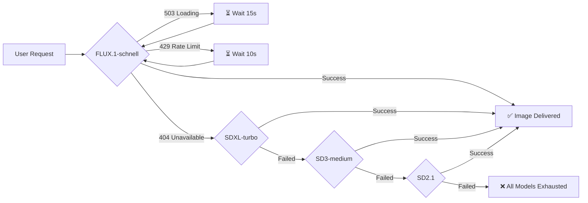

# 🎨 AI Art Generator

<div align="center">


**Transform your imagination into stunning visuals with AI-powered art generation**

[](https://nodejs.org/)
[](https://expressjs.com/)
[](https://render.com/)
[](https://huggingface.co/inference-api)

[🚀 Live Demo](https://ai-art-generator-4wlo.onrender.com) • [📖 Documentation](#-features) • [🤝 Contributing](#-contributing)

</div>

---

## 🌟 Overview

A cutting-edge full-stack web application that brings your creative visions to life. Powered by Hugging Face's state-of-the-art AI models, wrapped in a sleek cyberpunk-inspired glassmorphism interface that makes art generation feel like magic.

### ✨ Key Highlights

```
🎨 Multi-Model AI Engine    🔒 Enterprise-Grade Security    🎭 Stunning Dark UI
⚡ Smart Retry System       📱 Mobile-First Design          📥 One-Click Downloads
```

---

## 🎯 Features

<table>
<tr>
<td width="50%">

### 🤖 AI-Powered
- **Latest AI Models** - FLUX.1-schnell & SDXL integration
- **Intelligent Fallback** - 4-tier model cascade system
- **Smart Retry Logic** - Handles loading & rate limits
- **High Resolution** - 1024x1024 pixel outputs

</td>
<td width="50%">

### 🎨 User Experience
- **Cyberpunk Aesthetic** - Neon accents & glassmorphism
- **Lightning Fast** - 5-15 second generation
- **Responsive Design** - Works on all devices
- **Example Prompts** - Quick-start inspiration

</td>
</tr>
</table>

---

## 🚨 Important Note About Live Demo

> **⚠️ If the [Live Demo](https://ai-art-generator-4wlo.onrender.com) shows "All models failed" errors:**
> 
> This typically means the Hugging Face API token used in the hosted demo has **exhausted its free credits**. 
>
> **Solution:** Clone the repository and run it locally with your own API token:
> ```bash
> git clone https://github.com/nayansm004/Ai-Art-Generator.git
> cd Ai-Art-Generator
> npm install
> # Add your own HF_API_TOKEN to .env file
> npm start
> ```
> 
> **Why this happens:** Hugging Face free tier tokens have limited API credits. The public demo may hit these limits due to multiple users. Your personal token will give you fresh credits and full access to all features! 🎨

---

## 🚀 Quick Start

### Prerequisites

Before diving in, make sure you have:

| Requirement | Version | Link |
|-------------|---------|------|
| Node.js | 18+ | [Download](https://nodejs.org/) |
| npm | Latest | Included with Node.js |
| HF Account | - | [Sign Up](https://huggingface.co/join) |
| HF API Token | - | [Get Token](https://huggingface.co/settings/tokens) |

### Installation

```bash
# 1️⃣ Clone the repository
git clone https://github.com/nayansm004/Ai-Art-Generator.git
cd Ai-Art-Generator

# 2️⃣ Install dependencies
npm install

# 3️⃣ Configure environment
cp .env.example .env
# Edit .env and add your HF_API_TOKEN

# 4️⃣ Launch the server
npm start

# 5️⃣ Open your browser
# Navigate to http://localhost:3000
```

### Environment Setup

Create a `.env` file with the following:

```env
# Required
HF_API_TOKEN=your_hugging_face_token_here

# Optional
PORT=3000
HF_BASE_URL=https://router.huggingface.co/hf-inference
```

> 💡 **Pro Tip:** Get your token from [Hugging Face Settings](https://huggingface.co/settings/tokens) with "read" permissions

---

## 🏗️ Architecture

```
┌─────────────────────────────────────────────────────────┐
│                     Frontend (React)                    │
│  ┌──────────┐  ┌──────────┐  ┌────────────────────┐     │
│  │  HTML5   │  │   CSS3   │  │  Vanilla JS (ES6+) │     │
│  └──────────┘  └──────────┘  └────────────────────┘     │
└─────────────────────────────────────────────────────────┘
                           ↓
┌─────────────────────────────────────────────────────────┐
│              Backend (Node.js + Express)                │
│  ┌────────────────┐  ┌──────────────────────────┐       │
│  │  API Gateway   │  │   Smart Retry Logic      │       │
│  └────────────────┘  └──────────────────────────┘       │
└─────────────────────────────────────────────────────────┘
                           ↓
┌─────────────────────────────────────────────────────────┐
│           Hugging Face Inference API Router             │
│                                                         │
│  1. FLUX.1-schnell          (Primary - Highest Quality) │
│  2. SDXL-turbo             (Fast & Reliable Fallback)   │
│  3. SD3-medium             (Balanced Performance)       │
│  4. SD2.1                  (Most Reliable)              │
└─────────────────────────────────────────────────────────┘
```

---

## 📁 Project Structure

```
Ai-Art-Generator/
│
├── 📂 public/                 Frontend assets
│   ├── 🌐 index.html         Main application page
│   ├── 🎨 styles.css         Cyberpunk dark theme
│   └── ⚡ script.js          Client-side logic
│
├── 🔧 server.js              Express server + AI logic
├── 📦 package.json           Dependencies & scripts
├── 🔐 .env                   Environment variables
├── 📋 .env.example           Environment template
├── 🚫 .gitignore            Git ignore rules
└── 📖 README.md             You are here!
```

---

## 🎨 Usage Guide

### Creating Your First Image

1. **Enter a Prompt** - Be specific and descriptive
2. **Click Generate** - Wait 5-15 seconds
3. **Download & Share** - Save your masterpiece

### Example Prompts

```
🌲 Nature & Fantasy
"Mystical forest with glowing mushrooms and fireflies, fantasy art"
"Majestic dragon flying over mountain peaks at sunset, epic fantasy"

🏙️ Urban & Cyberpunk
"Futuristic sports car in neon-lit Tokyo street, cyberpunk style"
"Flying cars in a neon cityscape, blade runner aesthetic"

🎨 Abstract & Digital
"Abstract digital art with geometric patterns and vibrant colors"
"Colorful liquid paint explosion, macro photography"

🧙 Characters & Portraits
"Portrait of a wise owl wizard wearing a purple robe, digital painting"
"Steampunk inventor in workshop, highly detailed"
```

### Pro Tips for Better Results

| ✅ DO | ❌ DON'T |
|------|---------|
| Be specific and detailed | Use vague prompts |
| Mention art style | Make prompts too long (500+ chars) |
| Include lighting/mood | Request inappropriate content |
| Add quality descriptors | Leave out important details |

**Quality Enhancers:** Add these to any prompt
```
highly detailed, 8k, professional, dramatic lighting, 
cinematic, photorealistic, artstation trending
```

---

## 🔄 Multi-Model Fallback System

Our intelligent system ensures you always get results:



**Console Output Example:**
```
🧠 Trying model: black-forest-labs/FLUX.1-schnell
📡 Attempt 1/2 → black-forest-labs/FLUX.1-schnell
⏳ Model loading: waiting 15s
✅ Image generated via model black-forest-labs/FLUX.1-schnell (245KB)
```

---

## ⚙️ Configuration

### Environment Variables

| Variable | Description | Default | Required |
|----------|-------------|---------|----------|
| `HF_API_TOKEN` | Hugging Face API token | - | ✅ Yes |
| `PORT` | Server port number | 3000 | ❌ No |
| `HF_BASE_URL` | HF router endpoint | https://router.huggingface.co/hf-inference | ❌ No |

### Custom Model Order

Edit `MODEL_ROLLBACK` in `server.js`:

```javascript
const MODEL_ROLLBACK = [
  "your-custom/model-1",              // Your preferred model
  "black-forest-labs/FLUX.1-schnell", // High quality fallback
  "stabilityai/sdxl-turbo",           // Fast fallback
  "stabilityai/stable-diffusion-2-1"  // Reliable fallback
];
```

---

## 🐛 Troubleshooting

<details>
<summary><b>❌ "Missing Hugging Face API token"</b></summary>

**Solution:**
1. Verify `.env` file exists in root directory
2. Check `HF_API_TOKEN=your_token` is set correctly
3. Ensure no extra spaces around the token
4. Restart the server: `npm start`
</details>

<details>
<summary><b>⚠️ "All models failed or are unavailable"</b></summary>

**Possible Causes:**
- API token lacks "read" permissions
- Rate limits reached (wait 10-15 minutes)
- Models temporarily loading
- **Token credits exhausted** 💳

**Solutions:**
1. Check token permissions at [HF Settings](https://huggingface.co/settings/tokens)
2. Wait and retry in 10-15 minutes
3. Replace token with one that has available credits
4. Consider running models locally
</details>

<details>
<summary><b>🐌 Image generation is slow</b></summary>

**Expected Timings:**
- First request: 15-30s (model loading) ⏳
- Subsequent requests: 5-10s ⚡
- Rate limited requests: May be slower 🐢

**This is normal behavior!**
</details>

<details>
<summary><b>🖼️ Image not displaying</b></summary>

**Debug Steps:**
1. Open browser console (F12)
2. Check for JavaScript errors
3. Verify server is running (`npm start`)
4. Check Network tab for failed API calls
5. Clear browser cache (Ctrl+Shift+R)
</details>

---

## 🚀 Deployment

### Deploy to Render

```bash
1. Create account at render.com
2. Connect GitHub repository
3. Add environment variable: HF_API_TOKEN
4. Click "Deploy" ✨
```

### Deploy to Railway

```bash
1. Create account at railway.app
2. Click "New Project" → "Deploy from GitHub"
3. Add environment variable: HF_API_TOKEN
4. Deploy! 🚂
```

### Deploy to Heroku

```bash
# Install Heroku CLI & login
heroku login
heroku create your-app-name

# Set environment variable
heroku config:set HF_API_TOKEN=your_token_here

# Deploy
git push heroku main
```

---

## 📊 Performance Metrics

| Metric | Value | Notes |
|--------|-------|-------|
| First Generation | 15-30s | Model cold start |
| Subsequent Generations | 5-10s | Model warm |
| Image Resolution | 1024x1024 | High quality |
| Supported Formats | PNG, JPEG | Universal support |
| Concurrent Users | Multiple | Queue system |

---

## 🤝 Contributing

We welcome contributions! Here's how to get involved:

1. **Fork** the repository
2. **Create** a feature branch
   ```bash
   git checkout -b feature/amazing-feature
   ```
3. **Commit** your changes
   ```bash
   git commit -m 'Add amazing feature'
   ```
4. **Push** to the branch
   ```bash
   git push origin feature/amazing-feature
   ```
5. **Open** a Pull Request

### Contribution Ideas

- 🎨 New UI themes
- 🤖 Additional AI model integrations
- 🌐 Internationalization
- 📱 Mobile app wrapper
- 🎯 Advanced prompt engineering features

---

## 📜 License

This project is licensed under the **MIT License** - see the [LICENSE](LICENSE) file for details.

---

## 🙏 Credits & Acknowledgments

<table>
<tr>
<td align="center">
<br>
<b>Hugging Face</b><br>
Inference API Provider
</td>
<td align="center">
<br>
<b>Black Forest Labs</b><br>
FLUX.1-schnell Model
</td>
<td align="center">
<br>
<b>Stability AI</b><br>
Stable Diffusion Models
</td>
<td align="center">
🌟<br>
<b>Community</b><br>
Feedback & Support
</td>
</tr>
</table>

---

## 📞 Support & Contact

<div align="center">

[](https://github.com/nayansm004/Ai-Art-Generator/issues)
[](https://github.com/nayansm004/Ai-Art-Generator/issues)
[](mailto:your-email@example.com)

</div>

---

<div align="center">

### 🌟 Star This Project

If you find this project useful, please consider giving it a ⭐ on GitHub!

**Built with ❤️ by [nayansm004](https://github.com/nayansm004)**

---

**Happy Creating! 🎨✨**

*Transform your imagination into reality, one prompt at a time*

</div>